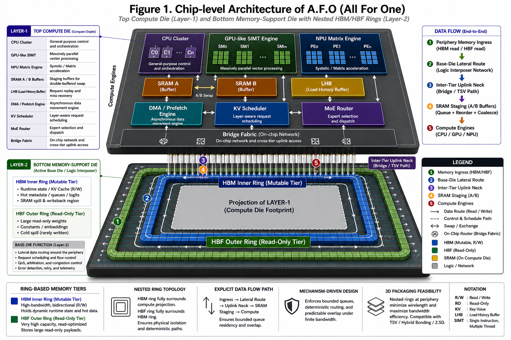
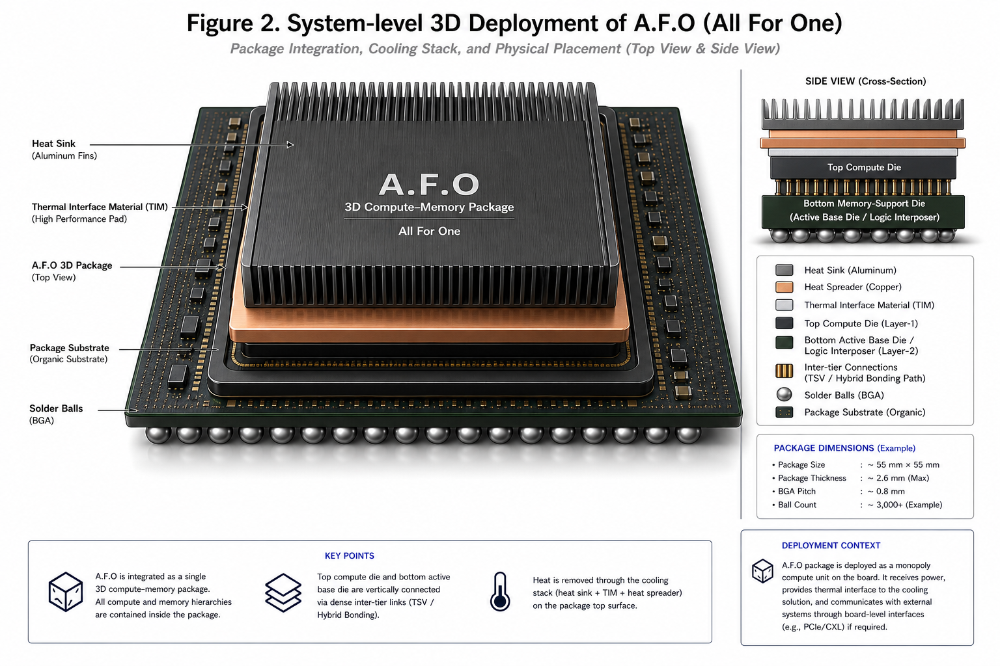
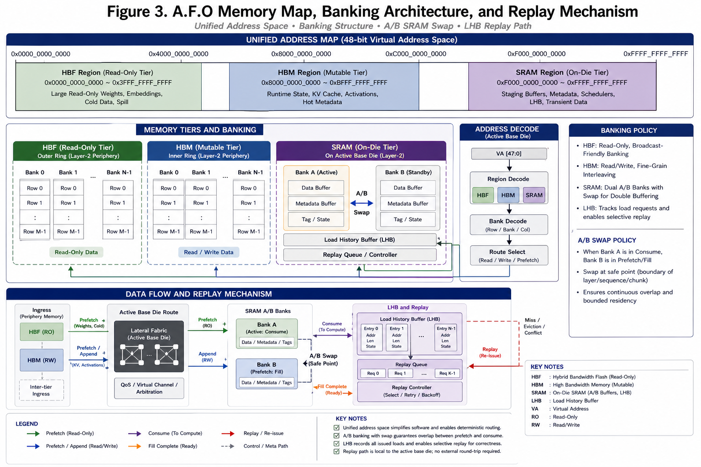
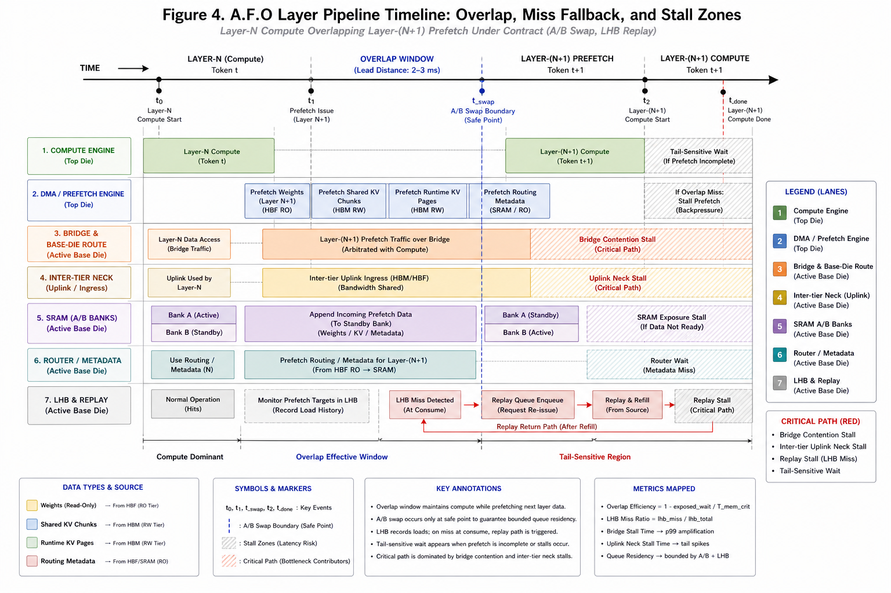
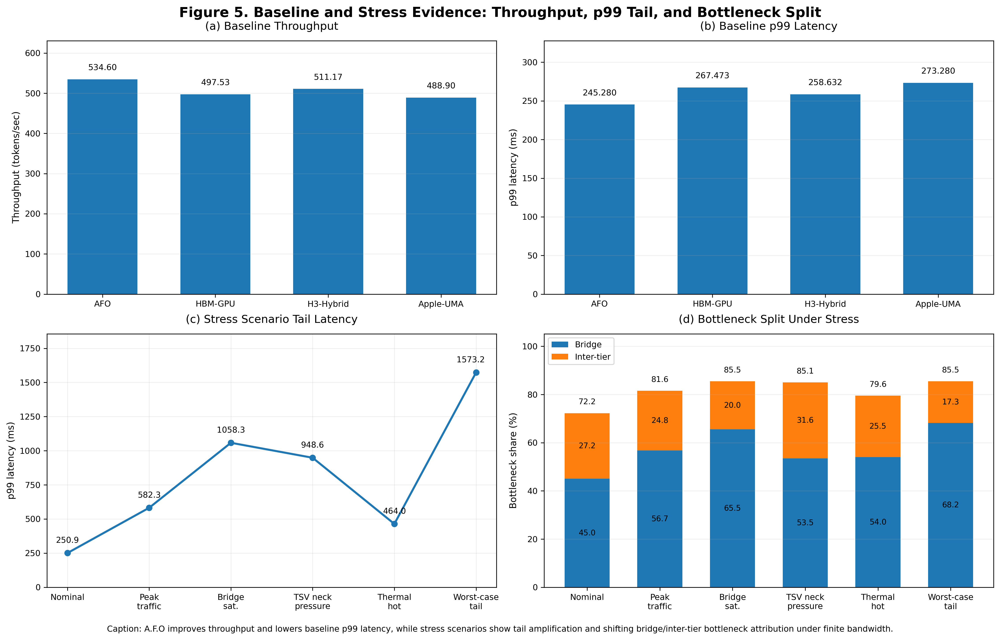
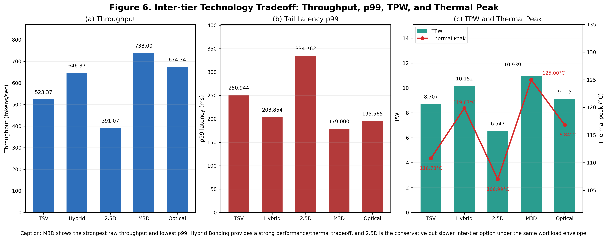
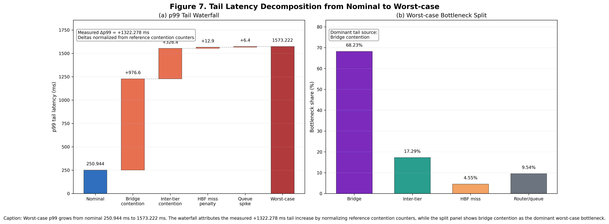
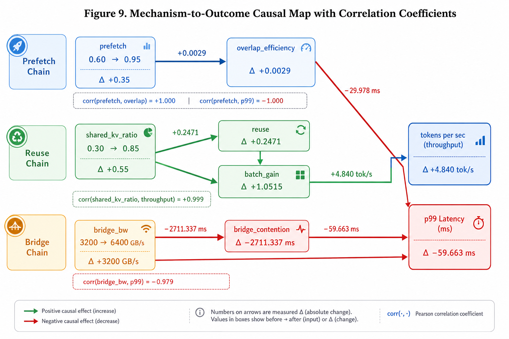
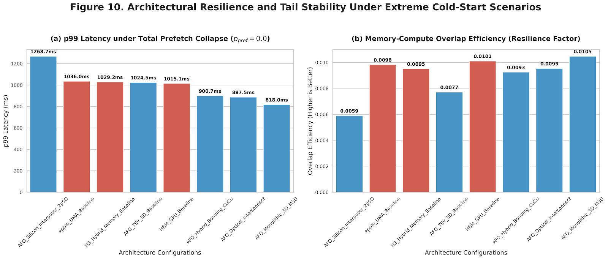

# A.F.O (All For One)

## A Mechanism-Driven 3D Compute-Memory Architecture for LLM Inference Under Finite Bandwidth Constraints

**Author:** JunHyeonBeak  
**Email:** fhzk1022@naver.com

---

## 1. Overview

A.F.O (All For One) is a mechanism-driven 3D compute-memory architecture designed for long-context LLM inference under finite package bandwidth constraints.

Unlike approaches that focus only on peak throughput or kernel-local optimization, A.F.O targets the system-level failure modes that appear under decode-dominant, multi-tenant, bursty inference workloads:

- bridge contention
- inter-tier uplink pressure
- unstable KV memory residency
- prefetch collapse
- thermal-throttle induced tail amplification

The architecture integrates:

- a top compute die
- a bottom memory-support die
- nested periphery HBM/HBF memory rings
- SRAM A/B staging
- LHB replay
- route-aware scheduling
- bounded queue residency
- bridge/inter-tier bottleneck attribution

The main objective of A.F.O is not merely to improve average throughput, but to bound worst-case tail latency under constrained package bandwidth.

---

## 2. Core Claim

A.F.O argues that stable long-context LLM inference requires explicit mechanism contracts across:

- data placement
- routing
- SRAM staging
- prefetch/replay behavior
- bridge/inter-tier queueing

The key claim is:

> Tail latency in long-context LLM inference is not only a kernel-level problem.  
> It is a system-level property caused by constrained package paths, memory-tier placement, bridge contention, inter-tier uplink pressure, and queue residency.

Therefore, A.F.O proposes a contract-driven compute-memory coordination mechanism to expose, attribute, and control these bottlenecks.

---

## 3. Architecture Summary

A.F.O uses a two-layer 3D package structure.

### Layer-1: Compute Die

The top layer contains compute resources such as:

- CPU-like control cluster
- GPU/SIMT-style compute engines
- NPU/matrix engines
- SRAM staging buffers
- routing and scheduling logic

### Layer-2: Memory-Support Die

The bottom layer acts as an active memory-support die / logic interposer and contains:

- active-base routing fabric
- bridge/inter-tier data paths
- nested HBM/HBF memory rings
- metadata and DMA/prefetch support logic

### Memory Role Separation

A.F.O separates memory roles as follows:

| Tier | Role |
|---|---|
| HBM | Mutable runtime KV state, hot metadata, frequently updated data |
| HBF | Large read-only payloads, cold spill data, model/semantic payloads |
| SRAM | Short-lived staging, A/B swap buffering, overlap control |
| LHB | Replay and fallback path for miss recovery |

This separation allows A.F.O to reduce unstable memory residency and improve predictability under contention.

---

## 4. Key Mechanisms

### 4.1 Bridge-Aware Scheduling

A.F.O explicitly models bridge bandwidth as a finite resource. Instead of assuming unlimited package-level bandwidth, it tracks bridge utilization and attributes tail latency spikes to bridge contention.

### 4.2 Inter-tier Uplink Modeling

A.F.O treats inter-tier connectivity as a selectable design variable, including:

- TSV
- hybrid bonding
- 2.5D silicon interposer
- monolithic 3D
- optical interconnect

This allows the architecture to compare different physical integration strategies under identical workload assumptions.

### 4.3 SRAM A/B Staging

A.F.O uses A/B SRAM staging to overlap:

- current-layer compute
- next-layer prefetch
- KV movement
- metadata routing

This enables deterministic layer-overlapped execution.

### 4.4 LHB Replay

The Load History Buffer (LHB) provides replay support when prefetch or HBF lookup fails. This prevents complete stall-lock under cold-start or low-prefetch-accuracy conditions.

### 4.5 Contract-Driven Queue Residency

A.F.O enforces bounded queue residency through explicit runtime contracts. The goal is to avoid unbounded queue buildup under bursty multi-tenant traffic.

---

## 5. Main Results

### 5.1 Baseline Performance

Under fairness-locked constraints, AFO_Proposed achieves:

| Architecture | Throughput | p99 Latency |
|---|---:|---:|
| AFO_Proposed | 534.60 tok/s | 245.280 ms |
| HBM_GPU_Baseline | 497.53 tok/s | 267.473 ms |
| H3_Hybrid_Memory_Baseline | 511.17 tok/s | 258.632 ms |
| Apple_UMA_Baseline | 488.90 tok/s | 273.280 ms |

A.F.O shows nominal improvements in both throughput and p99 latency.

However, the main contribution is not peak throughput alone. The main contribution appears under constrained multi-tenant stress, where A.F.O is designed to mitigate worst-case tail amplification.

### 5.2 Bridge / Inter-tier Bottleneck Split

In the calibrated baseline, AFO_Proposed shows the following bottleneck attribution:

| Bottleneck Source | Share |
|---|---:|
| Bridge | 45.59% |
| Inter-tier | 27.55% |

This confirms that tail latency is jointly affected by bridge contention and inter-tier uplink pressure.

### 5.3 Stress Scenario Behavior

Under inter-tier neck pressure:

| Scenario | p99 Latency |
|---|---:|
| Nominal | 250.944 ms |
| TSV neck pressure | 948.636 ms |
| Worst-case tail | 1573.222 ms |

This shows that package-level bottlenecks can sharply amplify tail latency under stress.

### 5.4 Inter-tier Technology Tradeoff

A.F.O compares five inter-tier candidates:

| Technology | Throughput | p99 Latency | Thermal Peak |
|---|---:|---:|---:|
| TSV | 523.37 tok/s | 250.944 ms | 110.78°C |
| Hybrid Bonding | 646.37 tok/s | 203.854 ms | 119.87°C |
| 2.5D Interposer | 391.07 tok/s | 334.762 ms | 106.99°C |
| M3D | 738.00 tok/s | 179.000 ms | 125.00°C |
| Optical | 674.34 tok/s | 195.565 ms | 116.84°C |

M3D provides the best raw performance, while hybrid bonding offers a strong performance/thermal tradeoff. The 125°C M3D case is interpreted as a logical simulation extreme, since real silicon would trigger DVFS or shutdown before sustained operation at that level.

### 5.5 Extreme Cold-Start Degradation

A.F.O also evaluates an extreme cold-start case where prefetch accuracy approaches zero.

| Architecture | p99 Latency | Degradation vs. Nominal | Overlap Efficiency |
|---|---:|---:|---:|
| HBM_GPU_Baseline | 1033.65 ms | +286.5% | 0.009 |
| Apple_UMA_Baseline | 1065.17 ms | +289.8% | 0.009 |
| H3_Hybrid_Baseline | 1076.01 ms | +316.0% | 0.009 |
| AFO_TSV Proposed | 1075.92 ms | +328.7% | 0.077 |

Although all architectures suffer under prefetch collapse, A.F.O maintains a 7.7x higher overlap efficiency compared to the HBM_GPU baseline.

This result supports the claim that A.F.O provides graceful degradation under systemic failure rather than merely improving nominal throughput.

---

## 6. Figure Guide

The paper contains ten figures. Each figure is tied to a specific part of the evidence chain.

### Figure 1. Chip-level Architecture

**Location in paper:** Section 4, A.F.O Architecture and Mechanisms  
**Purpose:** Shows the chip-level 3D structure of A.F.O.  
**Contents:** top compute die, bottom memory-support die, nested HBM/HBF rings, SRAM staging, compute engines, bridge/inter-tier routing concept.



### Figure 2. System-level 3D Deployment

**Location in paper:** Section 4, A.F.O Architecture and Mechanisms  
**Purpose:** Shows how the A.F.O package is physically deployed with package substrate, cooling stack, and system-level context.  
**Contents:** package substrate, heat sink, thermal interface material, top compute die, bottom memory-support die, BGA solder balls, side-view cross-section.



### Figure 3. Memory Map, Banking, and Replay

**Location in paper:** Section 4 / Section 5  
**Purpose:** Explains the memory hierarchy and implementation-facing memory regions.  
**Contents:** HBF address range, HBM address range, SRAM address range, SRAM A/B banks, metadata buffer, LHB replay path, prefetch/consume/append/replay arrows.



### Figure 4. Layer Pipeline Timeline

**Location in paper:** Section 4 / Section 5  
**Purpose:** Shows layer-overlapped execution between Layer-N compute and Layer-(N+1) prefetch.  
**Contents:** compute lane, DMA/prefetch lane, bridge/base-die route, inter-tier neck, SRAM A/B swap boundary, router metadata, LHB fallback branch, stall zones, critical path.



### Figure 5. Baseline and Stress Evidence

**Location in paper:** Section 7.2, Bridge-Inter-tier Split Attribution  
**Purpose:** Provides the first major experimental evidence panel.  
**Contents:** baseline throughput comparison, baseline p99 latency comparison, stress scenario tail latency, bridge/inter-tier bottleneck split.



### Figure 6. Inter-tier Technology Tradeoff

**Location in paper:** Section 7.3, Inter-tier Technology Comparison  
**Purpose:** Compares TSV, hybrid bonding, 2.5D, M3D, and optical interconnect options.  
**Contents:** throughput, p99 latency, TPW, thermal peak.



### Figure 7. Tail-Latency Root-Cause Waterfall

**Location in paper:** Section 7.3.2, Figure 7 Interpretation  
**Purpose:** Explains how nominal p99 latency grows into worst-case p99 latency.  
**Contents:** nominal p99, bridge contention contribution, inter-tier contribution, HBF miss contribution, router/queue contribution, worst-case bottleneck split.



### Figure 8. Thermal-Performance Coupling

**Location in paper:** Section 7.3.3, Figure 8 Interpretation  
**Purpose:** Links thermal peak, throttling ratio, throughput loss, and p99 growth under stress.  
**Contents:** thermal peak, throttling ratio, throughput collapse, p99 growth, throttling-to-tail coupling.


### Figure 9. Mechanism-to-Evidence Causal Map

**Location in paper:** Section 7.3.3 / Section 7.4  
**Purpose:** Shows causal links between architectural mechanisms and observed outcomes.  
**Contents:** prefetch chain, reuse chain, bridge chain, overlap efficiency, batch gain, throughput, p99 latency, directional correlations.



### Figure 10. Extreme Cold-Start Resilience

**Location in paper:** Section 7.5, Extreme Cold-Start Degradation Analysis  
**Purpose:** Shows architectural resilience when prefetch accuracy collapses toward zero.  
**Contents:** p99 latency under total prefetch collapse, memory-compute overlap efficiency, comparison between A.F.O and baseline architectures.



---

## 7. Suggested README Figure Order

For GitHub README, the recommended figure order is:

```text
1. Figure 1 - Chip-level architecture
2. Figure 2 - System-level deployment
3. Figure 4 - Layer pipeline timeline
4. Figure 5 - Baseline and stress evidence
5. Figure 6 - Inter-tier technology tradeoff
6. Figure 7 - Tail-latency waterfall
7. Figure 8 - Thermal-performance coupling
8. Figure 9 - Mechanism-to-evidence causal map
9. Figure 10 - Cold-start resilience
```

Figure 3 can be placed in a technical appendix section because it is more implementation-specific.

---

## 8. Validation Methodology

A.F.O is evaluated using:

- calibrated simulation
- sensitivity sweeps
- stress scenarios
- bottleneck attribution
- tail-latency metrics
- contract-level RTL validation
- external replay protocol

The goal is not to claim product-level silicon closure. The goal is to establish a reproducible architecture-feasibility evidence chain.

---

## 9. RTL Contract-Level Validation

A.F.O includes contract-level RTL validation for critical control blocks.

Validated components include:

- address decoder
- prefetch engine
- DMA queue behavior

Reported validation status:

| Item | Status |
|---|---|
| Contract testbench lint | PASS |
| Contract testbench simulation | PASS |
| Saturation peak queue | 12 |
| Drain cycles | 13 |
| Decoder unit coverage | 13/13 |
| Prefetch unit coverage | 7/7 |
| DMA unit coverage | 6/6 |

This validation is not intended to claim signoff-grade cycle accuracy. It supports implementability of the proposed queue and routing contracts.

---

## 10. Limitations

This work has several important limitations.

1. All performance numbers are simulation-derived.
2. Hardware baselines are architecture-envelope results, not vendor-measured silicon traces.
3. Thermal and process coupling are simplified.
4. Training extension is treated only as a policy validation scaffold.
5. Worst-case tail risk is not eliminated under severe burst traffic or low bridge bandwidth.
6. External gem5/Ramulator replay is required for stronger timing-equivalence claims.

A.F.O should therefore be understood as an architecture-feasibility and mechanism-integration paper, not as a production silicon claim.

---

## 11. Short Summary

A.F.O is a contract-driven 3D compute-memory architecture for long-context LLM inference under finite package bandwidth.

It combines HBM/HBF tiering, SRAM A/B staging, LHB replay, route-aware prefetching, bounded queue residency, and bridge/inter-tier bottleneck attribution to control tail latency under contention.

The main message of A.F.O is simple:

> Predictable long-context LLM inference requires system-level memory hierarchy contracts, not only kernel-local optimization.

A.F.O is therefore best understood as an architecture-feasibility and mechanism-integration study for bandwidth-constrained, memory-intensive, and latency-sensitive AI systems.
