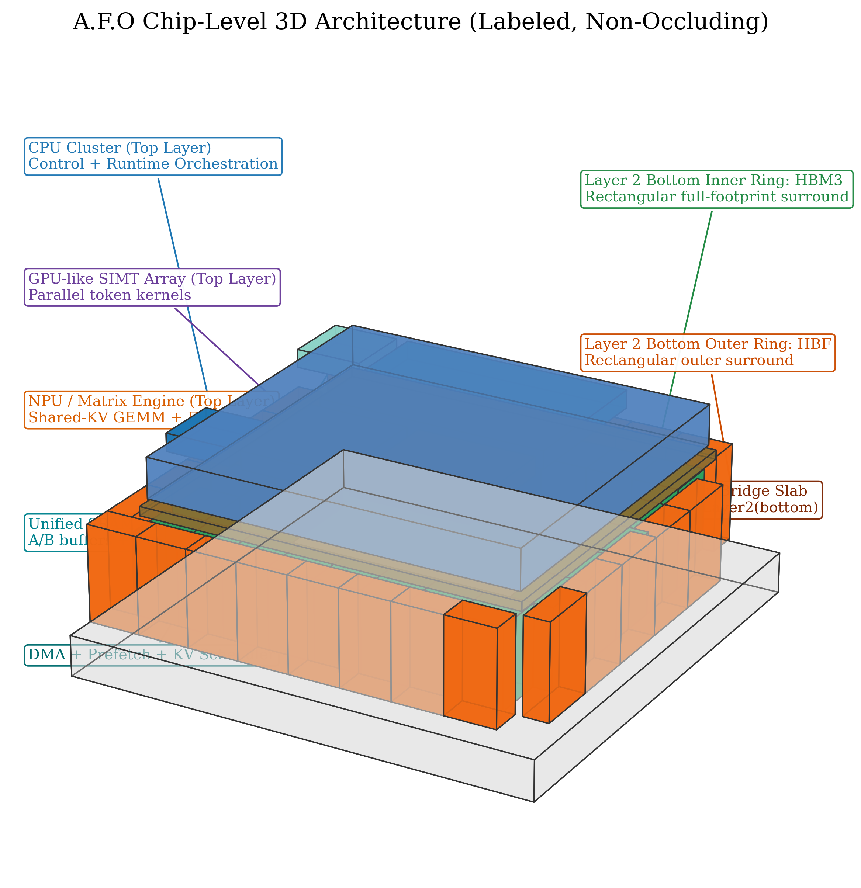
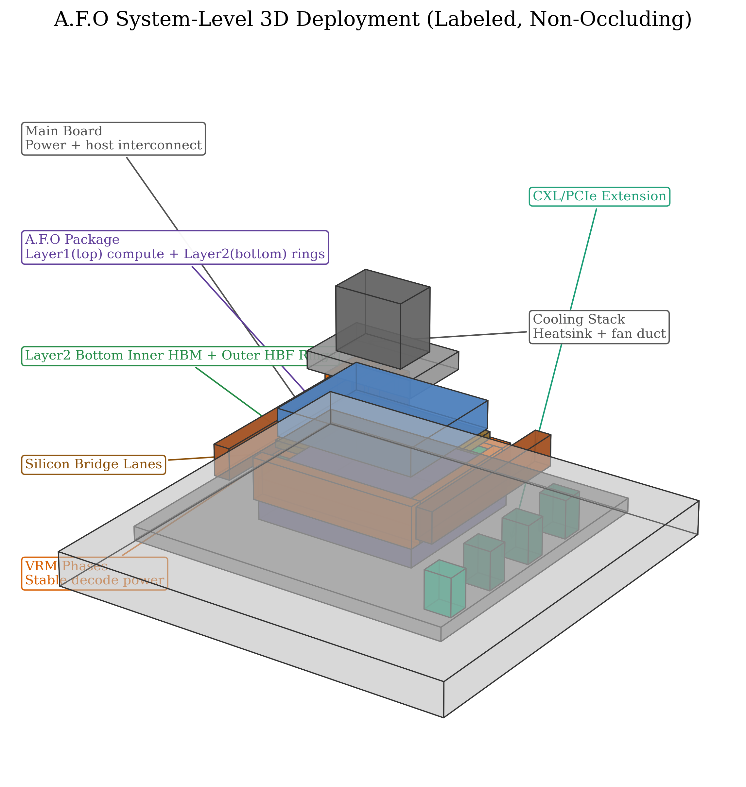
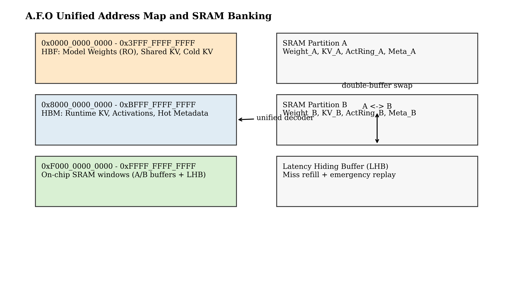
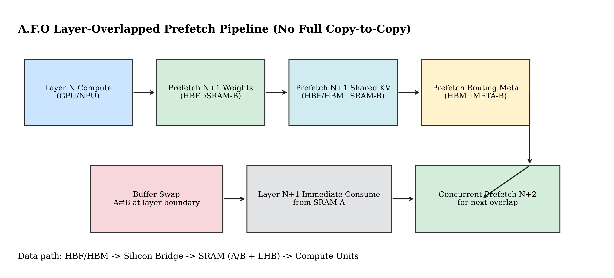
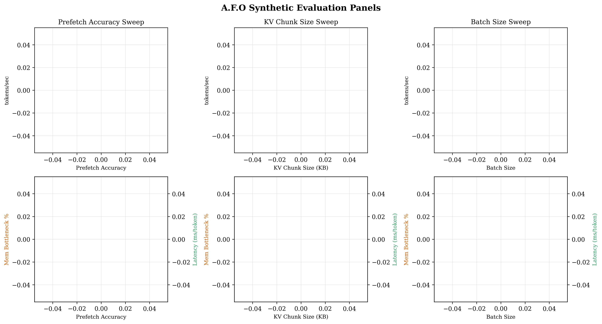
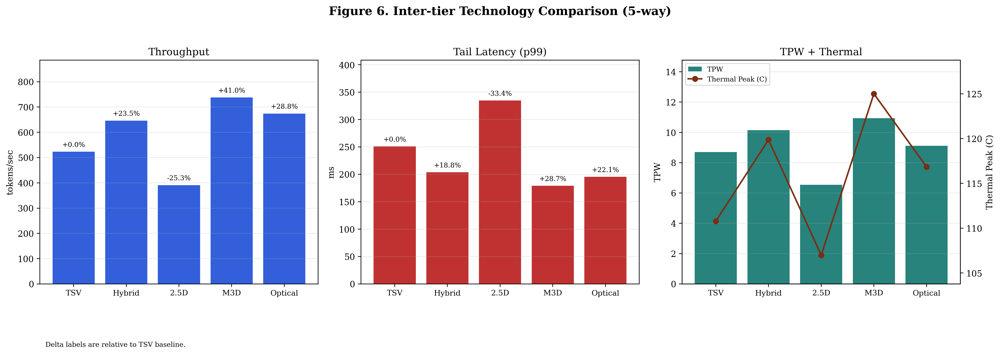
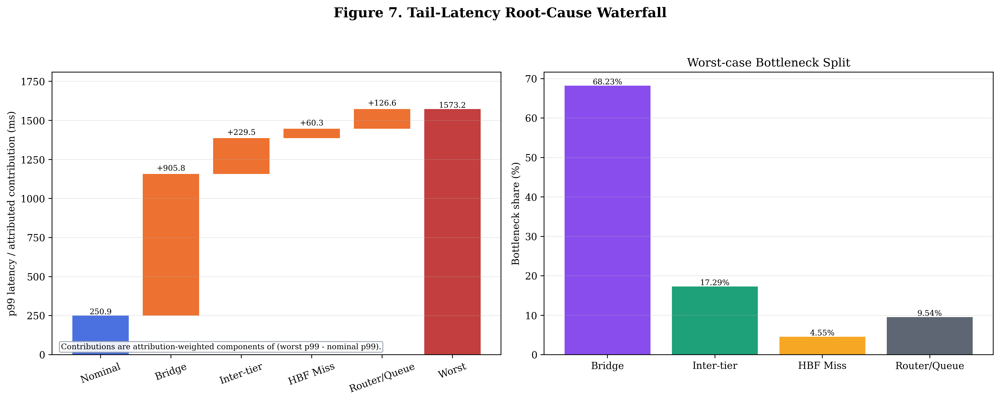
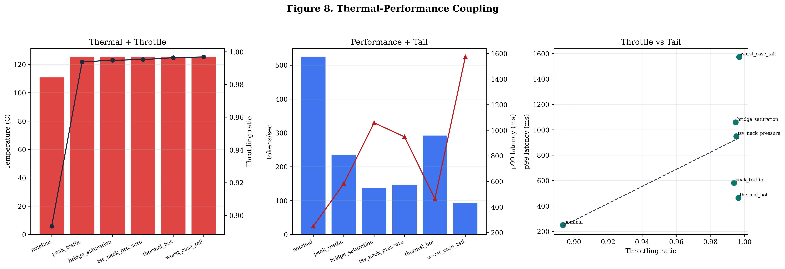
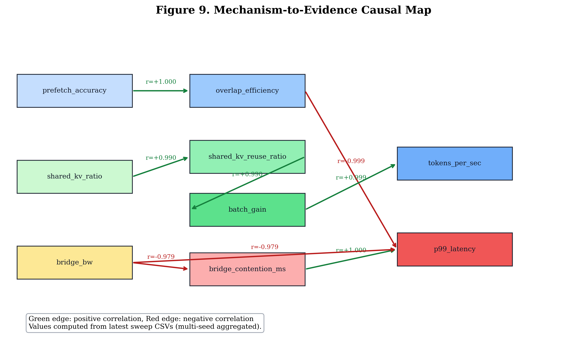
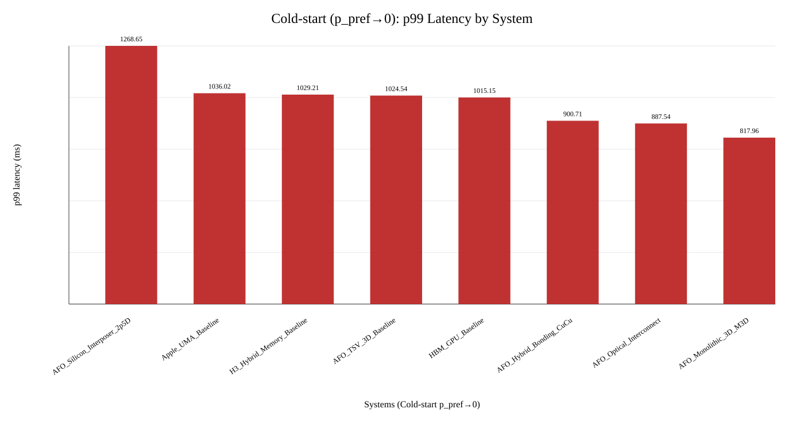

# A.F.O (All For One)

**Mechanism-Driven 3D Compute-Memory Architecture for LLM Inference Under Finite Bandwidth Constraints**

- Author: **JunHyeonBeak**
- Affiliation: **Department of Electronic Engineering, Kwangwoon University**
- Email: **fhzk1022@naver.com**
- Final thesis file: [AFO_Archive_Thesis_JunHyeonBeak_v18_userfig_rebuild.docx](docs/final_paper/AFO_Archive_Thesis_JunHyeonBeak_v18_userfig_rebuild.docx)

## Abstract
A.F.O는 장문맥 LLM 추론에서 반복적으로 발생하는 memory wall과 tail-latency 불안정성을 해결하기 위해, 패키징 계층(Top compute, Bottom memory-support die), 메모리 계층(HBM inner ring + HBF outer ring), 실행 계층(shared/unique KV 분리 + prefetch overlap)을 실행 계약(contract)으로 결합한 아키텍처입니다. 핵심은 부품의 단순 조합이 아니라, **finite bandwidth 조건에서 병목 이동(bottleneck migration)을 제어 가능한 메커니즘으로 강제**하는 데 있습니다.

## 1. Problem Statement
- F1: bridge queue residency 증가로 인한 tail 폭발
- F2: shared KV 재사용 실패로 인한 GEMM 효율 저하
- F3: prefetch 부정확 + HBF miss 노출로 인한 layer 경계 stall

## 2. Thesis Claim
A.F.O는 **not composition, but enforced mechanism** 원칙으로 동작합니다.
- tier-local placement
- deterministic overlap
- route-aware contention control

## 3. Architecture Summary
- Layer 1 (Top): compute die (CPU/GPU-like SIMT/NPU, SRAM A/B + LHB, DMA/prefetch, KV scheduler, MoE router)
- Layer 2 (Bottom): active base die + inner HBM rectangular ring + outer HBF rectangular ring
- Data path: memory periphery ingress -> base-die route -> inter-tier uplink neck -> SRAM -> compute
- Inter-tier candidate set: TSV / Hybrid Bonding / 2.5D Interposer / M3D / Optical

## 4. Analytical Model
\[
T_{layer}=\max(T_{compute},T_{HBM},T_{HBF}+\Delta_{miss},T_{bridge})+T_{router}+T_{SRAM\_exposed}
\]
\[
\Delta_{miss}=(1-p_{pref})(1-h_{lhb})(L_{HBF}+\beta T_{HBF}),\quad
Overlap_{eff}=1-\frac{exposed\_wait}{T_{mem\_crit}}
\]
\[
G_{batch}=\frac{Requests_{chunked}}{Unique_{chunks}},\quad
Reuse=1-\frac{Unique_{chunks}}{Requests_{chunked}}
\]

## 5. Figures (Paper-Aligned)

### Figure 1. Chip-level 3D Topology


### Figure 2. System-level 3D Deployment


### Figure 3. Memory Map + SRAM Banking


### Figure 4. Layer Overlap Pipeline


### Figure 5. Core Evidence Panels


### Figure 6. Interconnect 5-way Comparison


### Figure 7. Tail-Latency Root-Cause Waterfall


### Figure 8. Thermal-Performance Coupling


### Figure 9. Mechanism-to-Evidence Causal Map


### Figure 10. Cold-start Harsh Condition (p_pref -> 0)


## 6. Key Results Snapshot
- Baseline set: `AFO_Proposed`, `HBM_GPU_Baseline`, `H3_Hybrid_Memory_Baseline`, `Apple_UMA_Baseline`
- Interconnect set: `TSV`, `Hybrid Bonding`, `2.5D Interposer`, `M3D`, `Optical`
- Stress/tail 실험에서 bridge + inter-tier neck이 주요 지배 병목으로 관측됨

## 7. Reproducibility
```bash
python3 -m venv .venv
source .venv/bin/activate
bash scripts/run_all.sh
python3 experiments/scripts/compare_interconnect_techs.py --num-tokens 256 --seeds 11,23,37,53,79
python3 experiments/scripts/coldstart_prefetch_collapse.py
```

## 8. Result Paths
- Summary: [results/summary/simulation_summary.md](results/summary/simulation_summary.md)
- Baselines: [results/tables/baseline_comparison.md](results/tables/baseline_comparison.md)
- Interconnect comparison: [results/tables/interconnect_tech_comparison.md](results/tables/interconnect_tech_comparison.md)
- Cold-start harsh result: [results/coldstart/summary/coldstart_prefetch_collapse_summary.md](results/coldstart/summary/coldstart_prefetch_collapse_summary.md)

## 9. Scope and Limitations
- synthetic cycle-inspired simulator 기반
- interconnect 수치는 architecture sensitivity mapping (foundry signoff 아님)
- full-chip silicon-ready signoff가 아닌 architecture feasibility 단계
