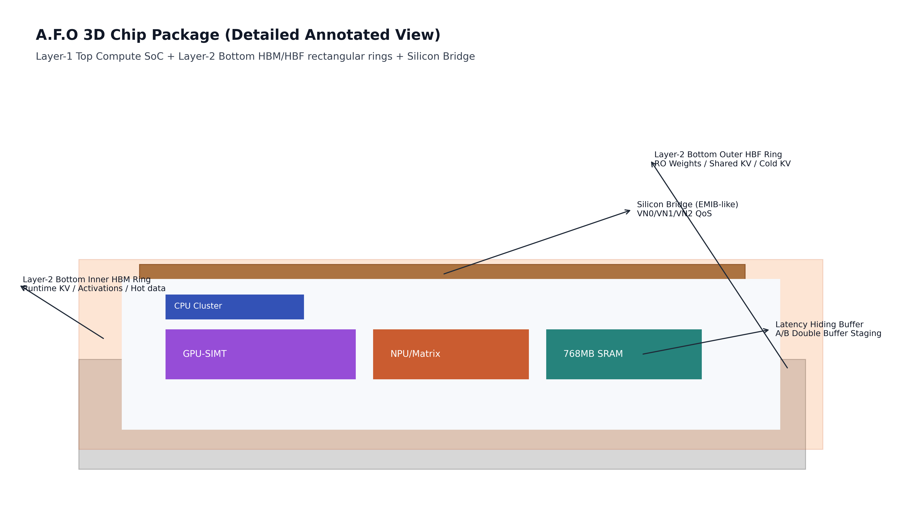
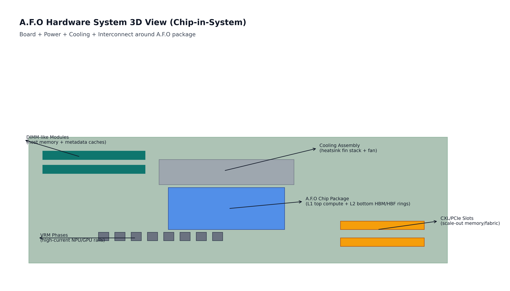
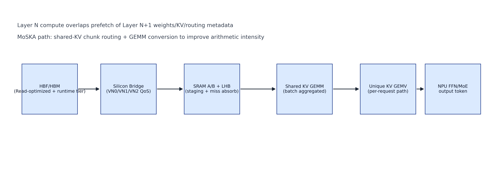

# Figure Atlas

## Figure 1: Chip-level 3D Annotated

설명:
1. Substrate: 패키지 기계적 기반
2. Compute die: CPU/GPU/NPU/SRAM 집적 영역
3. Bridge slab: memory traffic QoS 분리 통로
4. Layer-2 inner HBM rectangular ring: runtime KV/activation/hot 데이터
5. Layer-2 outer HBF rectangular ring: RO weights/shared KV/cold KV
6. SRAM zone: A/B buffering + LHB

## Figure 2: Full Hardware System 3D Annotated

설명:
1. Main board
2. A.F.O package and socket
3. VRM phase array
4. Heatsink fin stack + fan
5. CXL/PCIe expansion slots
6. host memory modules

## Figure 3: Layer Pipeline Dataflow

설명:
1. HBM/HBF source
2. Bridge VN QoS arbitration
3. SRAM staging (A/B + LHB)
4. Shared KV GEMM path
5. Unique KV GEMV path
6. NPU FFN/MoE and token output
